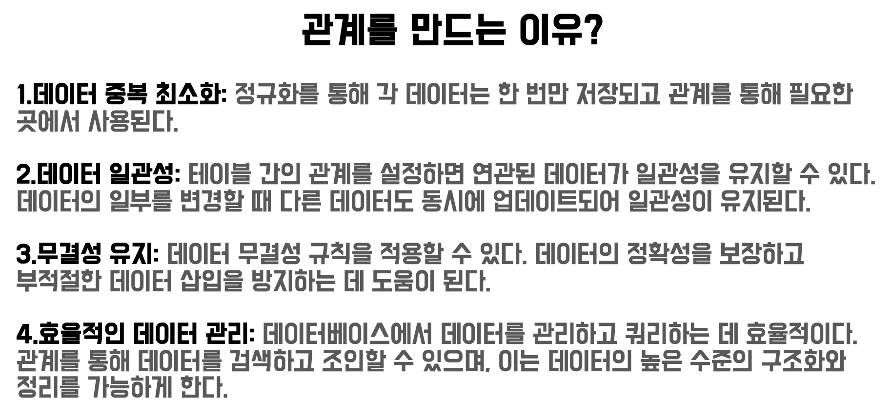
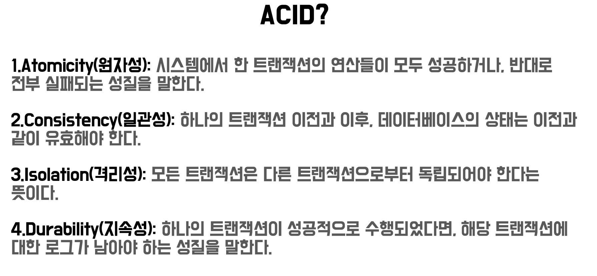
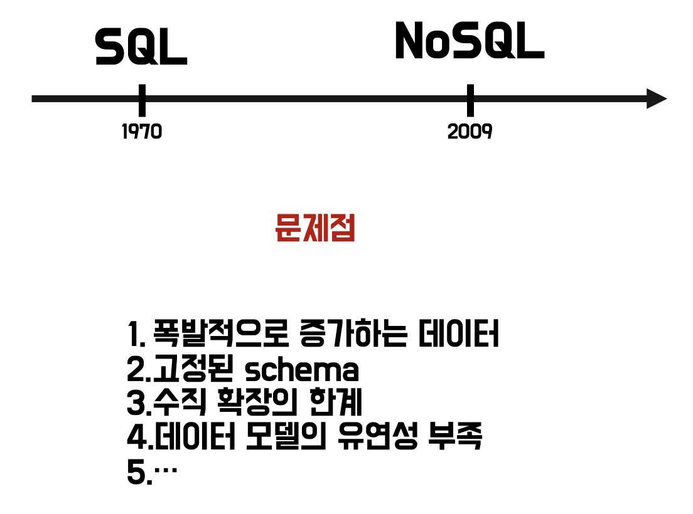
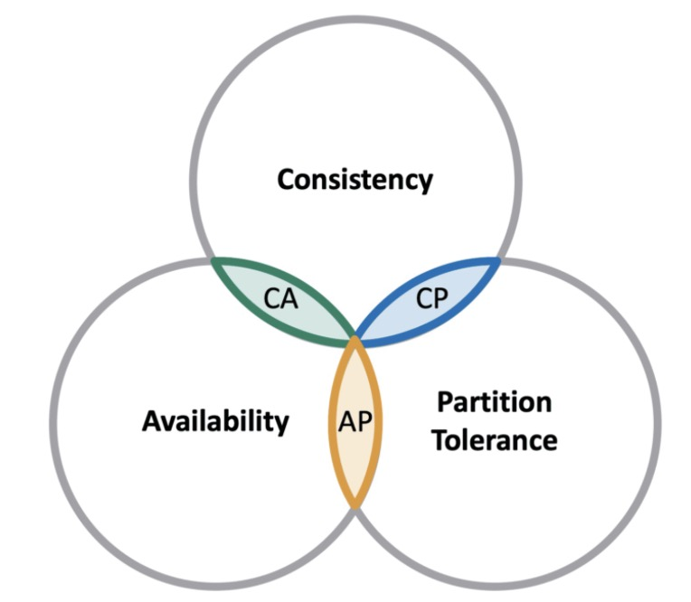

# Sql vs Nosql

## Sql?

SQL ( Structured Query Language )은 구문 언어로서 데이터베이스 관리 시스템 (DBMS)에서 데이터를 조작하고 검색하기 위한 표준화된 언어입니다. SQL은 대표적인 관계형 데이터베이스 관리 시스템인 Oracle, MySQL, Microsoft SQL Server, PostgreSQL 등에서 사용

## RDBMS?

Relational DataBase Management System

관계형 데이터 베이스 관리 시스템

### 특징

1. 정해진 스키마에 따라 테이블이 구성된다.

- Schema : 데이터 베이스에서 사용되는 전체 데이터 구조를 정의하는 객체

- Table : 데이터를 구성하는 가장 기본 단위

2. 테이블끼리 관계를 가진다.

3. Transaction을 사용한다.

- Transaction : 데이터베이스의 상태를 변화시키기 위해서 수행하는 논리적 작업 단위

## Sql의 문제점

## NoSql?

Not Only SQL, Non SQL … 등 SQL이 아닌 DB 를 통칭하는 것 Embed 저장 구조, 고정된 스키마 X

### 특징

- 유연성 : 스키마 선언 없이 필드의 추가 및 삭제가 자유로운 Schema-less 구조

- 확장성 : 스케일 아웃에 의한 서버 확장이 용이

- 고성능 : 대용량 데이터를 처리하는 성능이 뛰어나다

- 가용성 : 여러 대의 백업 서버 구성이 가능하여 장애 발생 시에도 무중단 서비스가 가능

### 종류

- Key-Value Database : Key와 Value로 구성된 배열구조의 데이터베이스로 가장 단순한 구조

- Document Database : 필드와 값의 형태로 구성된 데이터를 JSON 포맷으로 관리하는 데이터베이스

- Wide-Column Database : 관련 데이터를 단일 열 내에 중첩된 키/값 쌍의 집합으로 저장하는 데이터베이스

- Graph Database : 데이터 간의 관계를 저장하고 쿼리하도록 최적화된 데이터베이스

## CAP 이론

Network로 연결된 분산된 데이터베이스 시스템은 일관성, 가용성, 분할 내구성의 3가지 특성 중 2가지 특성만 충족할 수 있으며, 3가지 모두를 충족할 수는 없다는 이론

- 일관성(Consistency) : 모든 노드들은 같은 시간에 동일한 항목에 대하여 같은 내용의 데이터를 사용자에게 보여준다.

- 가용성(Availability) : 모든 사용자들이 읽기 및 쓰기가 가능해야 하며, 몇몇 노드의 장애 시에도 다른 노드에 영향을 미치면 안된다.

- 분할내성(생존성, Partiion tolerance) : 메시지 전달이 실패하거나 시스템 일부가 망가져도 시스템이 계속 동작할 수 있어야 한다.

## SQL과 NoSQL 중에서 어떤 것을 사용하는 것이 좋을까?

- 데이터베이스를 구축하는 방법을 선택하는 것에 완벽한 솔루션은 없다. 그렇기 때문에 많은 개발자들은 유저의 요구를 충족하기 위해 관계형, 비관계형 데이터베이스를 모두 사용하여 서비스에 맞게 설계해야 한다.

- NoSQL 기반의 비관계형 데이터베이스가 확장성이나 속도면에서 더 뛰어나다. 그러나 고차원으로 구조화된 SQL 기반의 데이터베이스가 더 좋은 성능을 보여주는 서비스도 있다.

- 여러 사용 사례를 살펴보고 적절한 데이터베이스를 선택하는 것이 중요하다

### SQL 기반의 관계형 데이터베이스를 사용하기 좋은 경우

- 데이터베이스의 ACID 성질을 준수해야 하는 경우

- 소프트웨어에 사용되는 데이터가 구조적이고 일관적인 경우

- 관계를 맺고 있는 데이터가 자주 변경되는 애플리케이션의 경우

### NoSQL 기반의 비관계형 데이터베이스를 사용하기 좋은 경우

- 정형화되지 않은 대용량의 데이터를 저장하는 경우

- 클라우드 컴퓨팅 및 저장공간을 최대한 활용하는 경우

- 빠르게 서비스를 구축하는 과정에서 데이터 구조를 자주 업데이트 하는 경우

- 읽기를 자주 하지만, 데이터 변경은 자주 없는 경우

