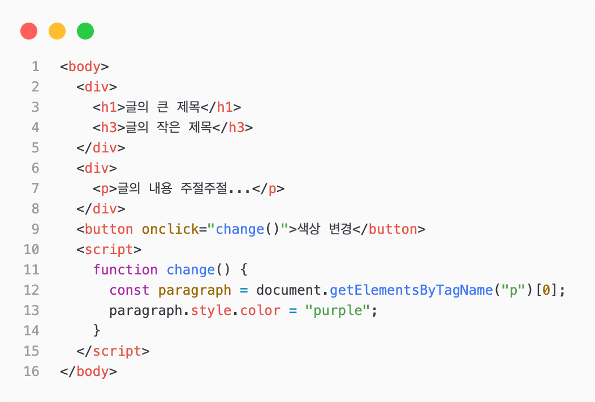
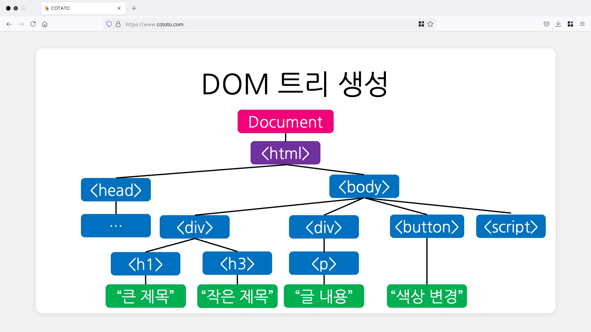
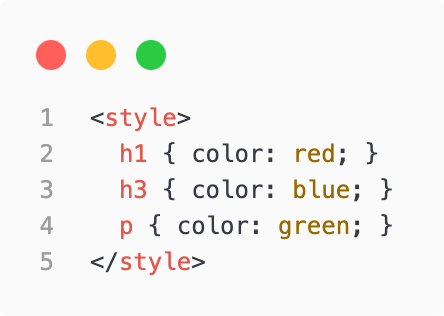
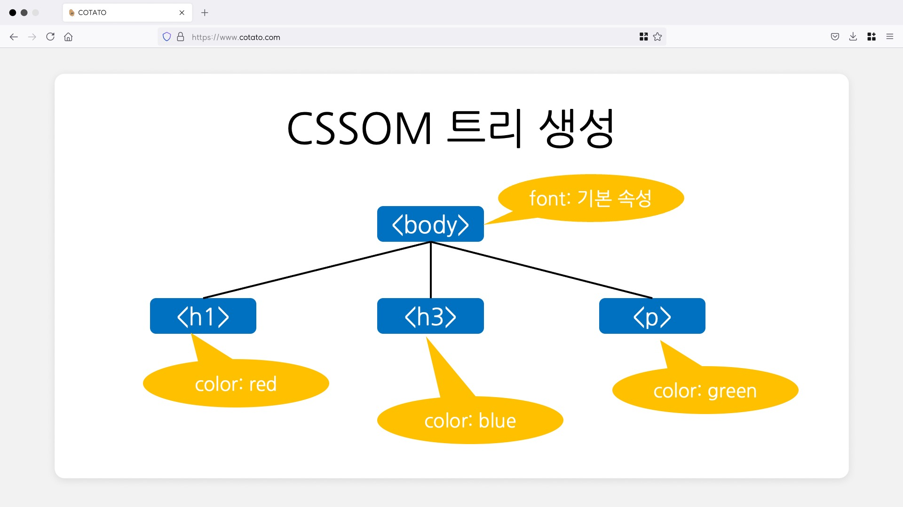
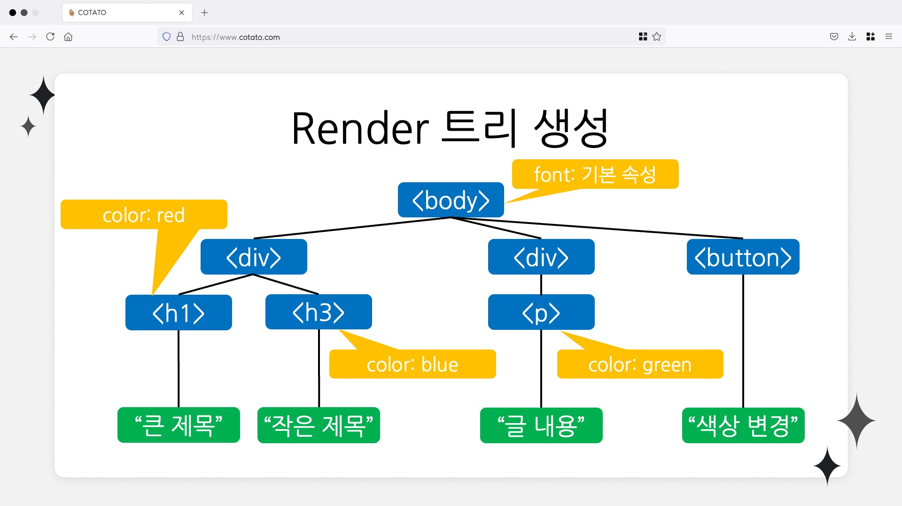
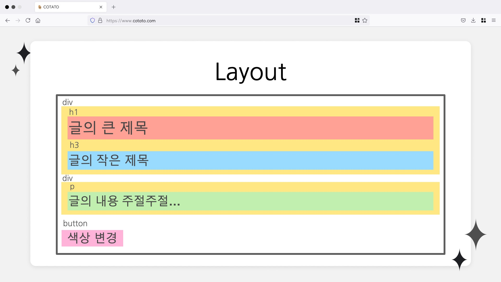
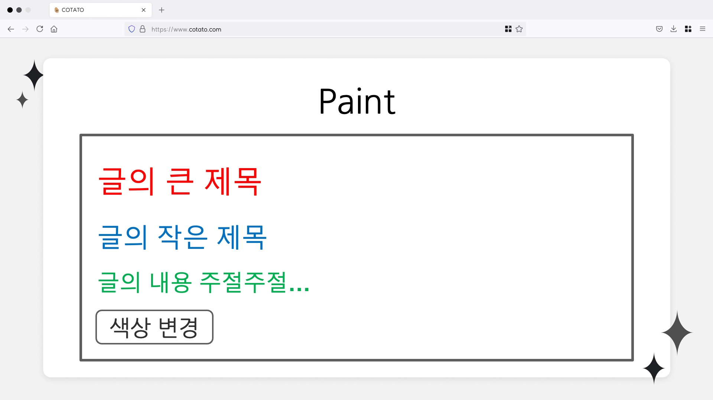

# 브라우저 렌더링

## 목차

- 브라우저 개념
- HTML CSS JS
- 브라우저 렌더링 과정
- 리블로우, 리페인트
- Virtual DOM

 

## 브라우저 개념

### 브라우저

- 웹 페이지, 이미지, 비디오 등의 콘텐츠를 수신 전송 및 표현하는 소프트웨어 -> 서버로 부터 HTML 파일을 받아와 사용자에게 보여주는 프로그램
  - C언어 실행은 gcc, Java 실행은 JVM, HTML CSS JS 실행은 브라우저
- 종류 : Chrome, Firefox, Edge, Safari, Opera

 

### 브라우저 구조

- 사용자 인터페이스
- 브라우저 엔진
- 렌더링 엔진
- 통신
- 자바스크립트 해석기
- UI 백엔드
- 자료 저장소

브라우저 렌더링 과정에서는 렌더링 엔진과 자바스크립트 해석기가 사용됨
 
렌더링 엔진은 브라우저 마다 다른 엔진을 사용

- blink : 크롬, 오페라, 엣지
- webkit : 사파리
- gecko : 파이어폭스

   

## HTML CSS JS

### HTML

- Hyper-Text Markup Language
  - 하이퍼텍스트 : 참조(하이퍼링크)를 통해 독자가 한 문서에서 다른 문서로 즉시 접근할 수 있는 텍스트 &rarr; 현재 문서에서 다른 문서로 건너 뛰기
  - 마크업 언어 : 태그 등을 이용하여 문서가 화면에 표시되는 형식을 나타냄 (HTML은 프로그래밍 언어가 아니다)

 

### CSS

- Cascading Style Sheet
- 정해진 속성들로 웹 페이지를 꾸미는 언어

 

### JavaScript

- 웹페이지에 생동감을 불어넣기 위한 프로그래밍 언어
- 웹페이지에서 어떤 버튼을 클릭하거나, 내용을 입력한 후 일어나는 모든 일을 컨트롤
- 원래 이름은 LiveScript였지만, 자바의 인기가 높아 홍보 목적으로 이름을 JavaScript로 변경 (자바랑은 다른 존재)
- 최근에 JavaScript를 대신해 많이 사용되는 TypeScript는 브라우저가 바로 해석할 수 없음
  - 트렌스파일러(transfiler)를 통해 TypeScript 코드를 JavaScript 코드로 변환을 해 주어야 브라우저가 인식이 가능

  

## 브라우저 렌더링 과정

### Critical Rendering Path

- 브라우저가 서버로 부터 HTML을 응답받아 화면에 그리기 위해 실행되는 단계
  DOM 트리 생성 -> CSSOM 트리 생성 -> 렌더링 트리 생성 -> 레이아웃 -> 페인팅

 

### DOM 트리 생성

HTML 코드

DOM 트리

- DOM 트리를 생성하기 이전에는 서버로부터 받아온 HTML 문서를 토큰 단위로 구분해 노드를 생성
- DOM(Document Object Model) : 웹 페이지의 콘텐츠 및 구조, 그리고 스타일 요소를 구조화 시켜 표현하여 프로그래밍 언어가 해당 문서에 접근하여 읽고 조작할 수 있도록 API를 제공하는 일종의 인터페이스
  - HTML 태그인 Document를 JS가 사용할수 있는 Object로 생성
  - 모델을 표현하는 과정에서 Tree 형태를 띄우게 됨

 

### CSSOM 트리 생성

CSS 코드

CSSOM 트리

- 문서의 스타일 관련 정보를 읽고 수정하기 위한 API 세트 (DOM과 비슷)
- JS가 CSS를 동적으로 조작할 수 있게 해줌

 

### Render Tree 생성

Render 트리

- DOM 트리와 CSSOM 트리가 결합됭 Render Tree 생성
- 페이지를 렌더링 하는데 필요한 노드만을 가짐 (display: none 제외) (script 제외)

 

### Layout

layout

- 요소들이 페이지에서 배치되는 위치와 방법, 각 요소의 너비와 높이 그리고 서로 관련된 위치를 결정
- 노드의 수가 많을수록 레이아웃이 길어지게 되어 DOM의 영향을 받음 -> DOM 트리를 잘 만드는게 최적화에 영향

 

### Paint

paint

- 레이아웃 단계를 통해 화면에 배치된 엘리먼트들에게 색을 입히고 레이어의 위치를 결정
- 레더링 트리에서 각 노드를 화면의 실제 픽셀로 변환 (레이아웃 단계에서 노드들의 위치, 크기, 색상을 결정)

   

## Reflow, Repaint

## Reflow

- 여러 이벤트를 통해 HTML 요소가 생성되거나, 기존 요소의 스타일이 변경되 변경의 영향을 받는 모든 노드에 대해서 렌더링 트리 생성과 레이아웃 과정을 다시 수행
- DOM 요소의 기하학적 속성이 변경되거나 브라우저 사이즈가 변할때

 

## repaint

- 변경된 요소를 화면에 그려주는 작업
- 리플로우가 발생하거나 요소의 스타일이 변경될때

- 리플로우랑 리페인트 작업을 줄이는게 성능 최적화에 중요

   

## Virtual DOM

### DOM의 문제점

- 노드의 수가 많아질 수록 속도가 느려지고, DOM 업데이트에 잦은 오류를 발생시킬 수 있음
- 모던 웹은 SPA로 개발되어, DOM 조작이 빈번하고, HTML 파일이 무거움
- DOM에 변화를 줄때 트리가 수정될때마다 렌더 트리가 계속해서 실시간으로 갱신

## 가상돔

- DOM을 가볍게 만든 JS 표현
- 실제 스크린에 렌더링 되지 않안 DOM을 직접 업데이트하는것보다 빠름
- 메모리에서 미리 처리하고 저장한 후 실제 DOM과 동기화하는 프로그래밍 (reconciliation)
- 동작
  - 데이터가 업데이트 되면, 전체 UI를 가상돔에 리렌더링
  - 이전 가상돔과 현재 가상돔을 비교
  - 바뀐 부분만 실제 돔에 적용
- diffing 알고리즘을 통해 변화가 일아논 DOM 요소만 새로 렌더링
- 근데 가상돔이 무조건 빠른건 아님
  - svelte는 가상돔을 쓰지 않아 더 빠름
  - 가상돔은 런타임에 발생하기에, 브라우저에서 JS 연산이 필요
  - Svelte는 인터프리터 방식이 아닌 배포전 미리 컴파일하여 변화를 반영
