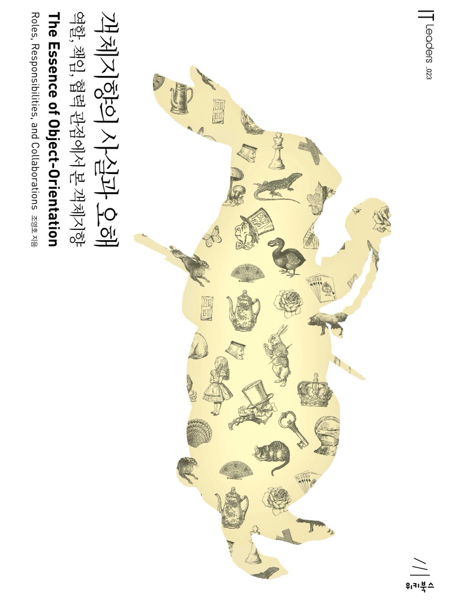
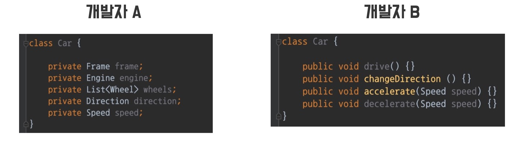
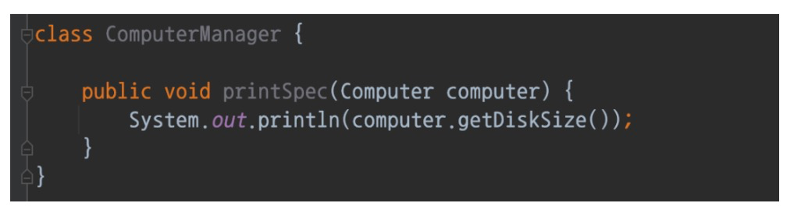
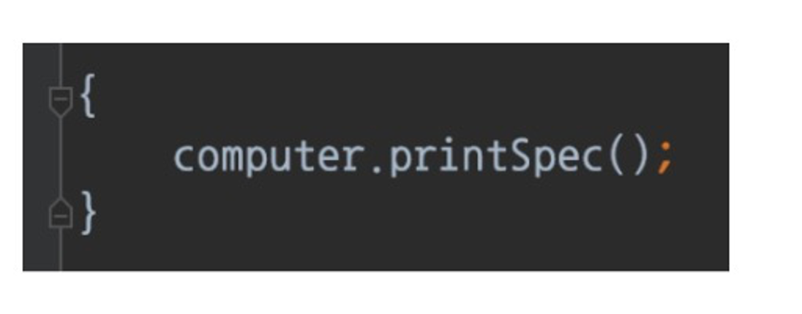

# 객체 지향

### 객체지향 프로그래밍의 특징
- 캡슐화
- 추상화
- 상속
- 다형성

### 객체지향설계원칙(SOLID)

- SRP (단일 책임 원칙)
- OCP (개방 폐쇄 원칙) 
- LSP (리스코프 치환 원칙)
- ISP (인터페이스 분리 원칙)
- DIP (의존관계 역전 원칙)

## 객제는 수동적인 존재가 아니라 능동적인 존재다!!

### 초보 개발자의 실수
- 객체를 c언어의 구조체처럼 수동적인 존재로 만든다.

### 객체지향 프로그래밍이란?

1. 프로그래밍 개발 방법론

2. 사람이 현실을 바라보는 방법을 개발에 접목
- 직관적으로 이해하기 쉽다.
-  유지보수를 용이하게 만든다.

### 객체란?
- 객체는 현실의 무언가에 대응하는 개념이다
 
 ex) 휴대폰, 노트북, 자동차 등등 

### 객체를 객체답게 이해하기 위해?

- 다른 객체와 협력(collaboration) 하는 역할(role)을 맡고 있는 대상

- 역할(role) 을 맡으면 임무를 수행할 책임(responsbility) 이 생긴다.

- 책임을 다하기 위한 데이터와 프로세스를 가지고 있다.

### 협력과 책임, 역할

협력(Collaboration) 이란?
 

    시스템 목표를 달성하기 위해 여러 객체가 참여하여 행동하는 것     
    ex) 손님이 커피를 주문하면 바리스타가 커피를 만들어 손님에게 전달한다.

책임(responsbility) 이란?
 

    협력 속에서 본인이 수행해야 할 임무의 내용을 알고, 수행하는 것
    ex) 바리스타는 손님의 주문을 받아 커피를 만들어야 한다.

역할(role) 이란?
 

    동일한 목적을 가진 책임의 묶음
    ex) 커피를 만들 책임을 가지는 역할은 바리스타다. 

### 메시지

- 객체는 메시지를 통해 다른 객체에 책임을 다하라고 요구한다.

- 메시지를 보내는 객체는 무엇을 할 지만 요구하고, 어떻게 하는지는 신경 쓰지 않아도 된다

- 객체는 책임을 수행하라고 요구 받지만, 어떻게 처리할 지는 자율에 맡긴다.

### 자율성 (의인화)

객체지향과 현실세계의 차이점
 

    현실 세계에서는 사람이 메뉴판을 보고 메뉴를 찾는다.
    객체지향 세계에서는 사람이 메뉴판에게 물어보고 메뉴판이 직접 메뉴를 찾아 사람에게 전달한다.

- 즉, 객체지향에선 객체가 자율적으로, 능동적으로 행동할 수 있다고 의인화 하여야 한다.

- 자율적으로 메시지를 처리하기 위해서 자신의 책임을 수행하는 데 필요한 데이터와 프로세스를 가지고 있다.

### 결론

- 객체는 현실의 개념을 추상화 한 것

- 객체들은 서로 협력하고, 역할을 맡아 책임을 수행하여 문제를 해결한다.

- 하지만 현실의 사물과 달리 능동적이고 자율적인 존재이다.

## 코딩할 때 사고하는 팁

### 개발자 A

- 자동차는 바퀴, 프레임, 엔진, 방향, 속도 값들을 갖고 있어 해.

### 개발자 B

- 자동차는 달릴 수 있어야 하고, 속도를 조절할 수 있어야 하고, 방향을 바꿀 수 있어야 해.

## 디미터 법칙

- 최소 지식의 법칙
- 모듈은 자신이 조작하는 객체의 속사정을 몰라야 한다.

1.

2. 

3. 
