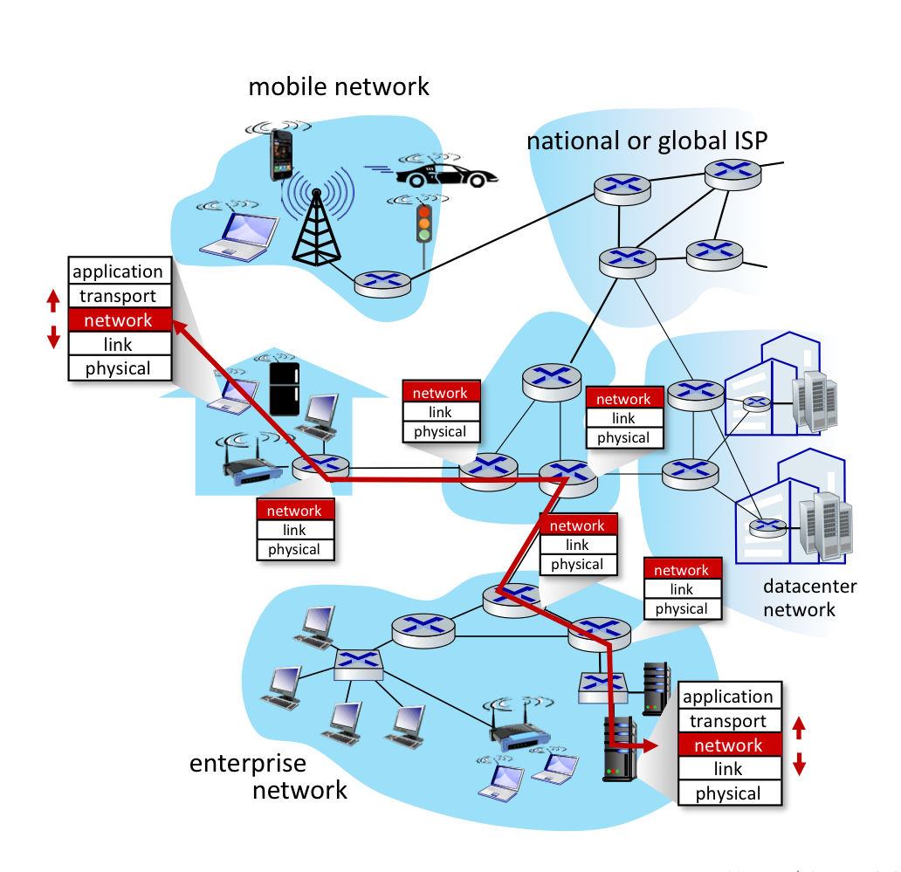
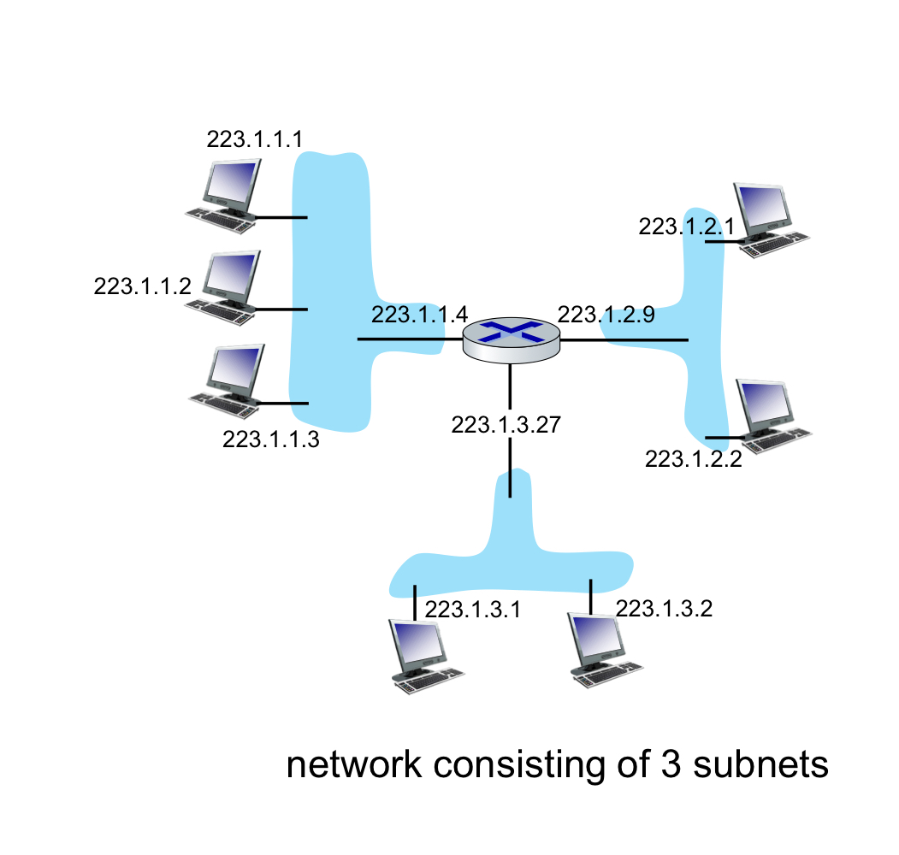
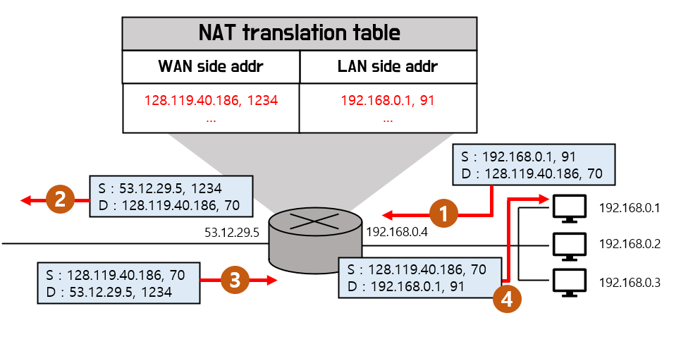
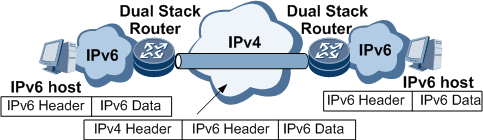

# IP 주소

## 목차

- IP주소 개념
- 서브넷
- DHCP
- NAT
- IPv6

 

## IP주소의 개념 (IPv4)

### OSI 7계층

**OSI 7계층** : 국제표준화기구(ISO)에서 개발한 모델로, 컴퓨터 네트워크 프로토콜 디자인과 통신을 계층으로 나누어 설명한 것

**7계층으로 분리한 이유** : 계층간 간섭 최소화. 유지 보수 편리. 데이터 캡슐화와 은닉.

**네트워크 계층** : 다른 네트워크끼리 연결 (라우터) -> 여기서 사용하는것인 IP프로토콜

 

### IP 주소를 가지는 기기들

우리가 **인터넷을 연결하는 거의 모든 기기**는 IP주소를 가짐 (컴퓨터, 노트북, 스마트폰, 태블릿, 스마트워치, 최신 가전기기)

**라우터** : 서로 다른 네트워크를 연결해 주는 장치로 현재의 네트워크에서 다른 네트워크로 패킷을 전송할 수 있도록 해줌. 데이터의 목적지까지 어떤 경로로 가는 것이 좋은지 알려주는 기능을 함

 

### IP주소 (IPv4)

**IP프로토콜(Internet Protocol)** : 인터넷이 통하는 네트워크에서 어떤 정보를 수신하고 송신하는 통신에 대한 규약을 의미

**IP주소** : 컴퓨터 네트워크에서 장치들이 서로를 인식하고 통신을 하기 위해서 사용하는 특수한 번호. IPv4와 IPv6 두 가지 체계가 있고, 현재까지 IPv4를 주로 사용.

**IP주소 체계(IPv4)** : 32비트의 길이를 가지며, 보통 8비트씩 끊어(옥텟) 이를 0~255의 10진수 숫자로 나타내고, 각 숫자는 점(.)으로 구분. 총 32비트의 정보를 가지므로 최대 2^32개, 약 43억개의 고유한 주소를 부여할 수 있음.  
ex) 93.184.216.34 (01011101 10111000 11011000 00100010)

   

## 서브넷(subnet)

### 서브넷

**네트워크 내부의 네트워크**. 라우터를 통과하지 않고 도달 가능  
네트워크의 관리를 용이하게 하고, 네트워크 내부에서 트래픽을 감소시키기 위해 전체 네트워크를 서브넷으로 분리

 

### 네트워크 주소 & 호스트 주소

**네트워크 주소** : 호스트(단말)들을 모은 네트워크를 지칭하는 주소 -> 서브넷

**호스트 주소** : 하나의 네트워크 내에 존재하는 호스트(단말)를 구분하기 위한 주소

IP 주소 = 네트워크 주소 + 호스트 주소

 

### 서브넷 마스크

IP 주소에서 **네트워크 주소와 호스트 주소를 분리**. 1비트의 부분은 네트워크 부분을 나타내고, 0비트의 부분은 호스트 부분을 나타냄.

255.255.255.0 -> 11111111 11111111 11111111 00000000  
10.21.20.45 -> 00001010 00010101 00010100 00101101  
네트워크 주소 : 10.21.20.0  
호스트 주소 : 0.0.0.45

 

### 클래스

**네트워크 주소와 호스트 주소의 길이를 지정**

A 클래스 : 네트워크 8비트, 호스트 24비트  
B 클래스 : 네트워크 16비트, 호스트 16비트  
C 클래스 : 네트워크 24비트, 호스트 8비트  
D 클래스 : 멀티캐스트 전용  
E 클래스 : 연구목적으로 예약

**CIDR** : Classless Inter-Domain Routing의 약자로, 클래스 없는 도메인간 라우팅 기법. 서브넷 마스크의 길이를 숫자로 표시하여 네트워크 주소를 유연하게 표현
ex) 192.168.10.70/26

   

## DHCP

### DHCP 개념

Dynamic Host Configuration Protocol의 약자로 **IP 주소를 네트워크에 연결된 장치에 자동으로 할당**.  
DHCP를 사용하지 않으면 관리자가 수동으로 IP주소를 할당. DHCP는 IP 주소와 서브넷 마스크 정보를 제공.  
DHCP를 통한 IP 주소 할당은 영구적으로 할당하는 것이 아닌 임대(lease)의 개념. 임대 기간이 종료되면 연장 또는 반납 과정을 거침.  
자동으로 IP 주소를 할당하기 때문에 수동으로 주소를 할당하는것에 비해 주소의 충돌 문제를 최소화 할 수 있고, 네트워크 관리 비용을 감소시킴. 하지만 서버에 의존적이고 사이버 공격에 취약.

 

### DHCP 과정

**discover** : 클라이언트가 서버를 찾고, IP 주소 할당을 요청. 브로드캐스트를 통해 가능한 모든 서버에게 요청

**offer** : 서버가 IP 주소를 요청한 클라이언트에게 사용 가능한 IP주소를 알려줌

**request** : 클라이언트는 offer 받은 정보를 통해 하나의 서버를 선택해 클라이언트가 사용할 IP 주소를 전달

**ACK** : 서버는 request에 있는 IP 주소 사용을 허가함을 알려줌

   

## NAT

### IPv4의 부족

IPv4의 길이는 32비트로 약 43억개를 사용 가능.  
IANA에서 2011년 2월 4일부터 IPv4의 할당 중지를 선언.  
IPv4가 나온 초기에는 컴퓨터가 많지 않은 시기였지만, 현재 IP 주소를 가지는 기기가 너무 많아진 상황.  
그래서 IPv4의 부족을 해결하는 기술들로 서브넷, DHCP, NAT 등이 있음.

 

### NAT 개념

네트워크 주소 변환(Network Address Translation)은 IP 주소를 변환하는 기술로 사설 네트워크에 속한 **여러 개의 호스트가 하나의 공인 IP 주소**를 사용하는 기술.  
IPv4의 부족을 해결하기 위해 사설 네트워크 내부에서는 사설 IP를 사용하고, 사설 네트워크 외부에서는 공인 IP를 사용.  
보통 일상에서 사용하는 공유기에는 NAT 기능이 탑재되어 있음.  
라우터는 NAT translation table에서 포트 번호와 IP 주소를 기록하여 공인 IP와 사설 IP를 매칭.

 

### NAT 과정

1. 192.168.0.1, 91에서 128.119.40.186, 1234에 접근을 시도
2. 라우터는 사설 IP 192.168.0.1, 91이 공인 IP 53.12.29.5, 1234로 변환됨을 기록하고, 공인 IP로 전환하여 목적지 IP에 접근
3. 외부에서 IP 주소 53.12.29.5, 1234로 접근하는 요청을 받을 시, NAT translation table에서 포트번호 1234를 확인하여 해당하는 공인 IP는 192.168.0.1, 91이 사설 IP였음을 확인
4. 공인 IP를 포트번호와 매핑되는 사설 IP로 전환하여 호스트에게 요청을 보냄

 

### NAT 장단점

**장점** : 공용 IP를 통해 IP 주소를 절약 가능.  
사설 IP는 외부에 알려지지 않아 외부 공격으로 부터 보호 가능

**단점** : 사설 네트워크 내부에 서버가 있는 경우 최초 요청이 외부에서 내부에 접근하기 때문에 translation table에 기록되지 않아 있는 문제 발생.  
전송 계층에서 사용하는 포트번호를 네트워크 계층에서 조작하여 계층화 위반

   

## IPv6

### IPv6 주소 체계

128비트의 길이를 가지며, 4개의 비트씩 16진수 숫자로 표시하고, 32개로 구성된 16진수 숫자를 4개씩 콜론(:)으로 구분. 총 128비트의 정보를 가지므로 최대 2^128개, 340,282,366,920,938,463,463,374,607,431,768,211,456개의 고유한 주소를 부여할 수 있음  
ex) 2606:2800:0220:0001:0248:1893:25c8:1946

 

### IPv4와 IPv6의 공존 (터널링)

모든 전자기기와 라우터가 동시에 IPv6로 전환될 수 없어 실제 IPv6가 보편화되게에는 오랜 시간이 필요.

**터널링** : IPv6 데이터그램을 IPv4 패킷에 캡슐화하여 IPv4 라우팅 토폴로지 영역을 통해 전송하는 방법.  
기존의 IPv4 라우팅 인프라를 활용하여 IPv6 트래픽을 전송하는 방법을 제공.  
IPv6 패킷은 그 영역에 들어갈때 IPv4 패킷 내에 캡슐화되고, 그 영역을 나올 때 역캡슐화.  
터널의 양단간의 장비는 반드시 두 개의 프로토콜을 지원하는 장비(Dual Stack)이어야 함.
